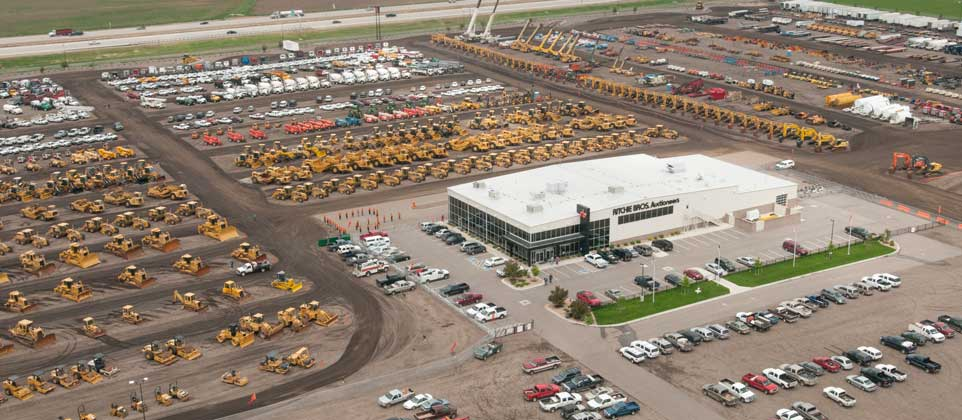
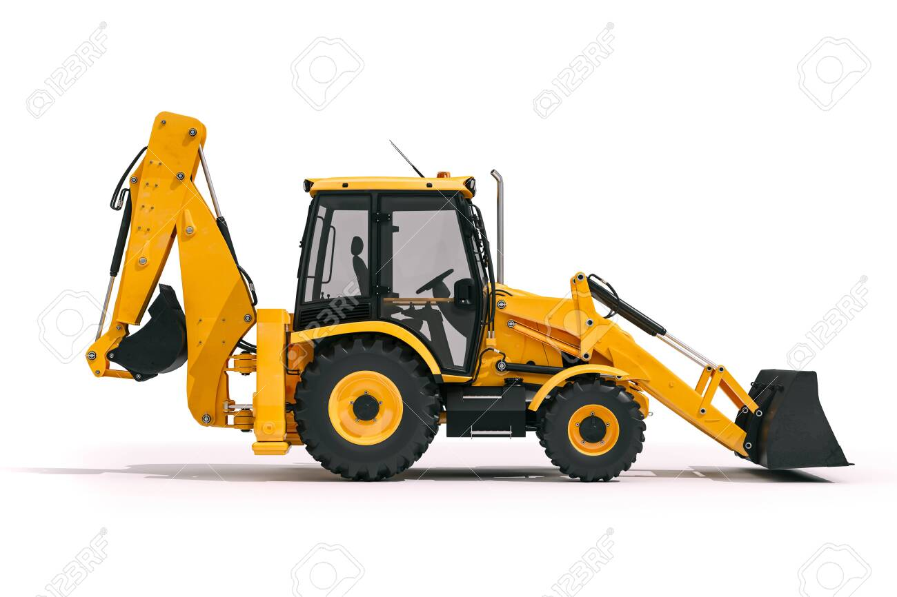
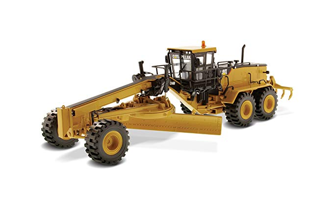
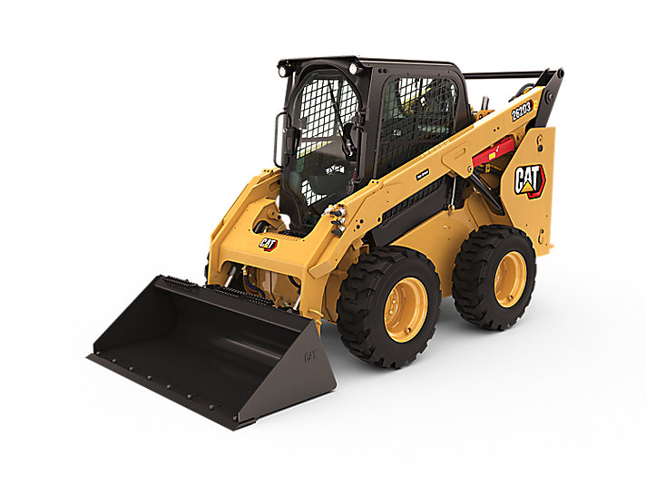
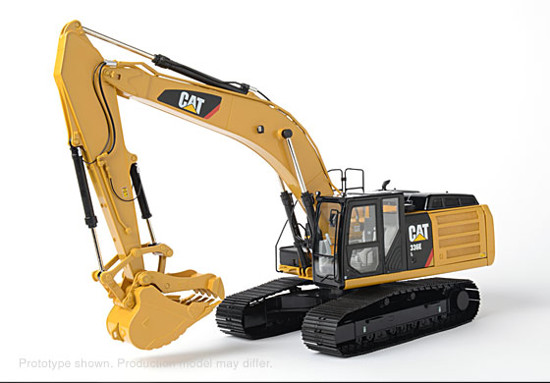
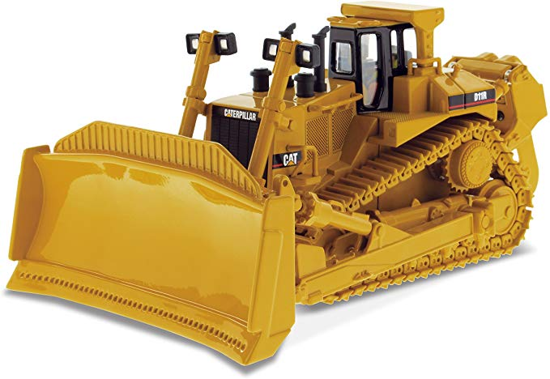
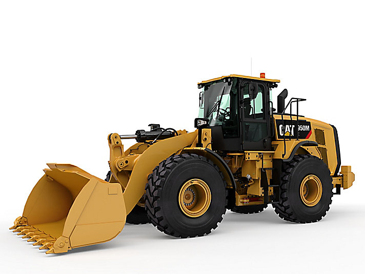
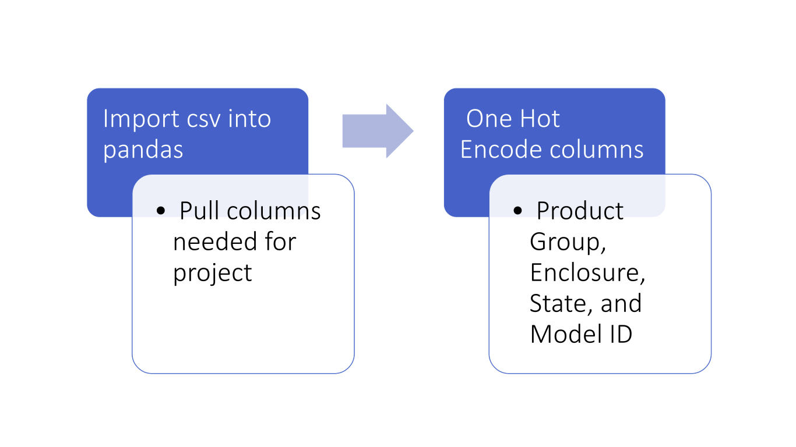
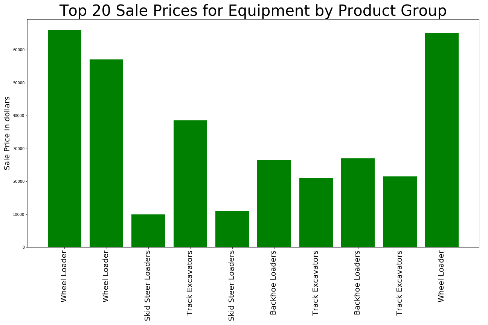

# Predict Heavy Equipment Auction Price

## Background

Heavy equipment or heavy machinery are vehicles specifically designed for executing construction tasks, such as earthwork operations and roadside or building construction. Action houses like Ritchie Bros. Aucitoneers are large scale action houses that rental and construction companies use to buy and sell used equipment. The price associated with each piece of equipment sold is largely based off of the equipment type, the year made, and the number of hours the equipment has been used. The youngest pieces of equipment with the least amount of run time are therefore priced the highest. 

  

    
    
  

## Case Study Goal
Predict the sale price of a particular piece of heavy equipment at auction based
on it's usage, equipment type, and configuration.  

## Data

The data is sourced from auction result postings and includes information on usage and equipment configurations. There are 53 columns included in the dataset but for the purpose of our analysis we used machine id, sale price, year made, machine hours current meter, product group, enclosure, and State. 

The six types of equipment included in the given dataset are below: *names are in order from left to right, top to bottom*

Backhoe Loader, Motor Grader, Skid Steer Loader, Track Excavator, Track Type Tractor, Wheel Loader

  

    
    
    
    
    
    
  

## EDA 

Cleaning this dataset mainly invoved one hot encoding the equipment features from strings. 

  

    
  

  

    
  

## Predictions

The imputation algorithm used a K neighbors regressor to estimate missing values of Machine Hours Current Meter. Approximately 65% of the values for this feature were missing. The imputation involved splitting the dataset into two sets: one set representing data that was associated with missing values of the machine hours and another set that represented data that had machine hour values. The K Neighbors regressor was trained on the dataset which included machine hour values and was used to estimate the values for the dataset that did not have machine hour values. Estimation was conducted by using the sales price and year made for each machine auction to estimate the number of machine hours on the machine.

For our linear model using Root Mean Squared Logarithmic Error the following columns were used: imputed machine hours, hc product group, hc, enclosure, hc state

|         | Linear Regression  |
|---------|--------------------|
|Ridge    | Test Error = 0.625 |
|         | True Error = 0.619 |

